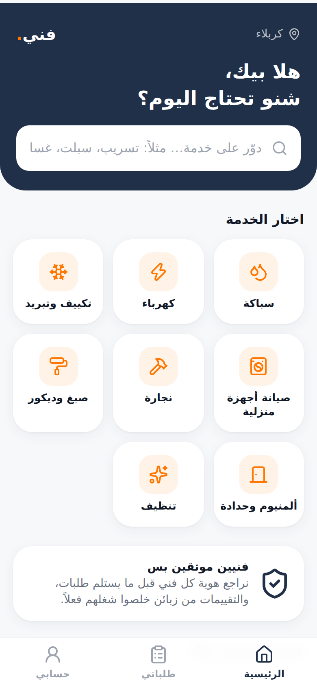
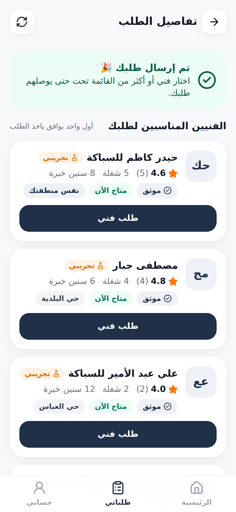
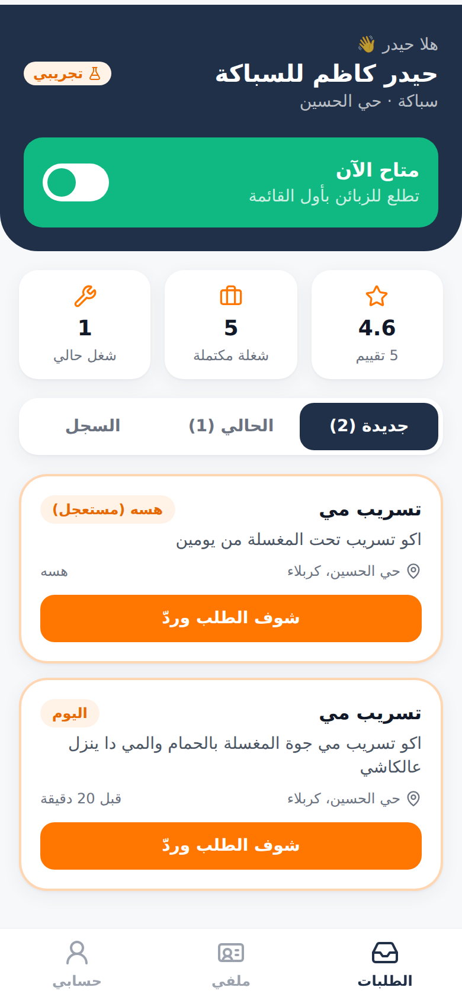
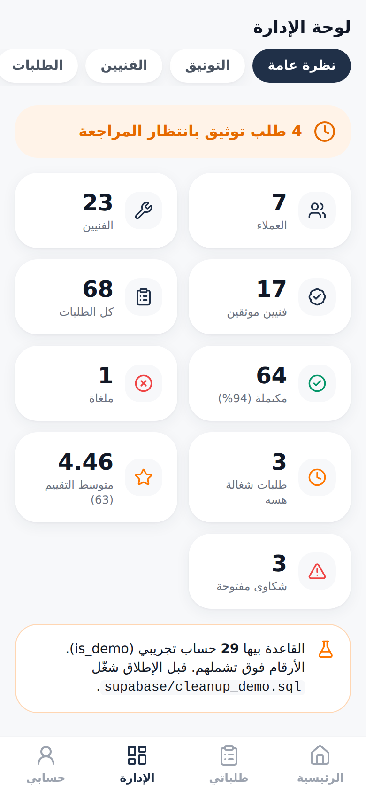

# فني (Fanni) — MVP

منصة تربط الزبائن بفنيين موثقين قريبين منهم بكربلاء: سباكة، كهرباء، تكييف وتبريد، صيانة أجهزة، نجارة، صبغ وديكور، ألمنيوم وحدادة، تنظيف.

<p>   </p>

Mobile-first Arabic (RTL) PWA · React + Vite + Tailwind · Supabase (Postgres, Auth, Storage, RLS)

---

## 1. Run it (15 minutes)

### A. Create the Supabase project
1. Create a project at [supabase.com](https://supabase.com) (region: Frankfurt `eu-central-1` is the closest to Iraq).
2. **SQL Editor** → run these files **in order** (copy/paste each one):
   1. `supabase/migrations/20261003000001_schema.sql`
   2. `supabase/migrations/20261003000002_functions.sql`
   3. `supabase/migrations/20261003000003_rls.sql`
   4. `supabase/migrations/20261003000004_storage_realtime.sql`
   5. `supabase/seed.sql` ← demo data (skip in production)
3. **Authentication → Providers → Email**: for the free trial phase turn **off** "Confirm email" so people can sign up and use the app immediately. (If you leave it on, the app shows a "check your email" screen.)
4. **Authentication → URL Configuration**: set Site URL to where the app is hosted.

> With the Supabase CLI instead: `supabase link` then `supabase db push` and run the seed, or locally `supabase start && supabase db reset` (applies migrations + `seed.sql` automatically).

### B. Run the web app
```bash
cd fanni
cp .env.example .env.local      # put your project URL + anon key (Settings → API)
npm install
npm run dev                      # http://localhost:5173  (add --host to open it from your phone on the same Wi-Fi)
```

### C. Deploy (free)
Vercel / Netlify / Cloudflare Pages: root `fanni`, build `npm run build`, output `dist`, env vars `VITE_SUPABASE_URL`, `VITE_SUPABASE_ANON_KEY`. Add an SPA rewrite (`/* → /index.html`). Open it on a phone → "Add to Home Screen" installs it like an app (PWA).

### D. Phone notifications (Web Push, free)
1. Run `supabase/migrations/20261006000010_push.sql` (already inside `setup_all.sql`). It stores a shared secret and the project URL (`supabase_url`) in `private.settings`. Change the URL there if you use another project.
2. Edge Functions → new function **`send-push`** → paste `supabase/functions/send-push/index.ts` → deploy → turn **JWT verification OFF**.
3. That's it: the VAPID key pair is generated by the function the first time someone taps «فعّل الإشعارات» and stays in the database.

Android (Chrome) works in the browser or installed; iPhone needs iOS 16.4+ and the app added to the Home Screen. Telegram notifications keep working alongside.

---

## 2. Test accounts (after `seed.sql`)

Password for **all** of them: `Fanni@2026`

| Role | Email | What to try |
|---|---|---|
| Admin | `admin@fanni.test` | `/admin` — stats, verification queue, complaints, reviews, users, services |
| Customer | `customer@fanni.test` | Has requests in every state: one waiting for providers, one in progress, one **completed and ready to rate**, one cancelled |
| Provider (verified plumber) | `provider@fanni.test` | Has a **new offer** to accept, an **accepted job** to move forward, rating history |
| Provider (pending) | `provider.pending@fanni.test` | Waiting for admin approval — approve it from the admin account |
| 20 demo providers | `provider01…20@demo.fanni.test` | Spread over the 5 main services |
| 5 demo customers | `customer1…5@demo.fanni.test` | Authors of the demo requests/reviews |

---

## 3. What's implemented

**Customer:** home ("شنو تحتاج اليوم؟", service search, categories, my requests, nearby providers) → service page → provider profile (rating, completed jobs, area, availability, verified badge, portfolio, reviews with 4 aspect scores, "طلب الخدمة") → 6-step request wizard (service → problem type → description + optional photo → city/area/landmark + optional GPS → time → review) → matching list → send to up to 5 providers → live status timeline → phone/WhatsApp unlocked after acceptance → rate (1–5 + punctuality / quality / behaviour / price + comment) → complaint after completion → see admin's reply.

**Provider:** register as provider → onboarding (display name, specialty, city/area, years, bio, avatar) → portfolio upload → ID upload to a **private** bucket → pending → (admin approves) → "متاح الآن" toggle → inbox of offers → accept/decline → "طالع بالطريق" → "بديت الشغل" → "خلصت الشغل" → history with reviews. Can withdraw from an accepted job before starting (request goes back to matching).

**Admin:** overview stats (customers, providers, verified, requests, completed %, cancelled, active, avg rating, open complaints, demo-row warning) · verification queue (view document via 10-minute signed URL, approve / reject / request more info with notes) · providers · requests (filter by status, cancel) · complaints (status + notes visible to customer) · reviews (hide/unhide, ratings recalculated) · users (role, suspend) · services (add/edit/hide, problem types, icon, order).

**Matching** (`match_providers`): same service + verified + active account + same province, ranked by: available now → same area → same city → distance (only if both sides shared GPS) → rating → completed jobs.

**Request statuses:** `NEW → MATCHING → ACCEPTED → ON_THE_WAY → IN_PROGRESS → COMPLETED → RATED`, plus `CANCELLED`. Transitions are enforced in the database, not the UI.

**Not built (by design):** payments, wallet, chat, coupons, referrals, maps, AI, multi-country/language, subscriptions. Payment is cash between customer and provider; the app says so in the flow.

---

## 4. Database structure

| Table | Purpose | Key relations |
|---|---|---|
| `users` | Profile for every auth user: role, name, phone, email, city/area, `is_active`, `is_demo` | `id → auth.users` |
| `services` | Catalog: Arabic name, icon, `problem_types[]`, order, active | — |
| `providers` | Provider profile: display name, specialty, years, bio, location, `verification_status`, `is_available`, `rating_avg`, `rating_count`, `completed_jobs` | `id → users`, `service_id → services` |
| `provider_portfolio` | Work photos | `provider_id → providers` |
| `verification_requests` | ID document path (private bucket), status, admin notes, reviewer | `provider_id → providers` |
| `service_requests` | The job: service, problem, description, photo, location, time slot, status, assigned provider, timestamps | `customer_id → users`, `provider_id → providers` |
| `provider_requests` | Offers ("طلب فني") sent to providers: offered / accepted / declined / cancelled / withdrawn | `request_id`, `provider_id`; unique per pair |
| `reviews` | One per request: overall + 4 aspects + comment, `is_hidden` | `request_id` (unique), `provider_id`, `customer_id` |
| `complaints` | Linked to a completed request; status + admin notes | `request_id`, `customer_id`, `provider_id` |

**Storage buckets:** `avatars` (public), `portfolio` (public), `request-photos` (private — owner, offered provider, admin), `verification-docs` (private — owner + admin only).

### Security model (RLS + functions)
- Customers only see their own requests, offers on them, and complaints.
- Providers only see requests offered/assigned to them; they cannot read customer profiles.
- Phone numbers are not publicly readable: `get_request_contacts()` reveals them only to the two parties **after acceptance** (also protects your future lead-fee model from people bypassing the platform).
- All status changes go through `SECURITY DEFINER` functions that check who is calling and the allowed transition. There is no client `UPDATE` policy on requests.
- Reviews can only be created by `submit_review()` for the caller's own **COMPLETED** request, once. Providers can't insert, edit or delete reviews; only admin can hide them.
- Providers can't change their own verification status, rating, job counter, or demo flag (trigger-protected). Users can't change their own role.
- Only admin can approve verification (`review_verification()`). Verification documents are never public.
- Only verified providers with active accounts appear publicly and in matching.

### Demo data
Every demo row has `is_demo = true` (users, providers, portfolio, verifications, requests, offers, reviews, complaints), all demo emails end with `fanni.test`, the UI shows an orange **"تجريبي"** badge + a notice on demo provider profiles, and the admin overview warns while demo rows exist. Before launch: create your real admin, then run `supabase/cleanup_demo.sql`.

---

## 5. Tests

```bash
# Database security & business rules (93 checks) — run against a freshly seeded DB
psql "$DATABASE_URL" -v ON_ERROR_STOP=1 -f supabase/tests/security_test.sql

# Full end-to-end flow in a phone-sized browser (needs the app running against a seeded project)
npx playwright install chromium   # once
APP_URL=http://localhost:5173 node e2e/full-flow.mjs

# Push notifications (needs a production build: the service worker only exists there)
npx vite build --mode staging --outDir /tmp/dist-test && npx vite preview --outDir /tmp/dist-test --port 4173
APP_URL=http://127.0.0.1:4173 node e2e/push-flow.mjs
```
The E2E script covers: browsing → customer signup → 6-step request with photo → matching → offer → provider accept → on the way → in progress → completed → rating → complaint → new provider onboarding with portfolio + ID upload → admin approval (document via signed URL) → complaint resolution → provider goes "available" → another customer is blocked from the request. Screenshots land in `e2e/screenshots/`.

---

## 6. Project layout
```
fanni/
  supabase/migrations/   schema, functions, RLS, storage+realtime
  supabase/seed.sql      demo data          supabase/cleanup_demo.sql
  supabase/tests/        security_test.sql
  src/lib/               supabase client, auth context, types, Karbala locations, helpers
  src/components/        UI kit, layout + bottom nav, cards
  src/pages/customer/    Home, ServicePage, ProviderProfile, NewRequest, MyRequests
  src/pages/provider/    Onboarding, Dashboard, ProfileEdit, shared (verification, portfolio)
  src/pages/admin/       Overview, Verifications, Manage (users/providers/services/requests/complaints/reviews)
  src/pages/             RequestDetail (role-aware), Auth, Account
  scripts/               icon + placeholder generators
  e2e/                   full-flow.mjs
```
Edit Karbala cities/areas in `src/lib/constants.ts`.
